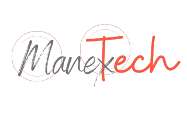
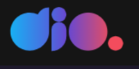

    

<h1 style="color:#fb5940;border:none;padding-bottom:0">Desafio de código</h1>
<h2 style="color:#ab4d3a;padding-bottom:1rem">Bootcamp da plataforma DIO.</h2>

Este repositório tem por objetivo armazenar os desafios de código propostos neste bootcamp.

<h2 style="color:#fb5940">Módulo - Dominando Python para Ciência de Dados.</h2>

<h3 style="color:#fb5940;font-size:1.35rem">Sistema Bancário simples</h3>
<h5 style="color:#ab4d3a;font-size:1.25rem">Habilidades Estudadas</h5>

Sistema simples com o objetivo de aplicar os conhecimentos adquiridos e desenvolvimentos das técnicas ensinadas.

<ul>
<li>Tipos de operadores;</li>
<li>Estruturas condicionais;</li>
<li>Estruturas de repetição;</li>
<li>Manipulação de strings.</li>
</ul>

Neste projeto, tive a oportunidade de criar um Sistema Bancário em Python. O objetivo foi implementar três operações essenciais: depósito, saque e extrato. O sistema foi desenvolvido para um banco que busca monetizar suas operações. Durante o desafio, tive a chance de aplicar meus conhecimentos em programação Python e criar um sistema funcional que simula as operações bancárias. Aprimorando minhas habilidades e demonstrando minha capacidade de desenvolver soluções práticas e eficientes.

 

<a>Acesse a plataforma</a>

## 🚀 Sobre mim
# Me chamo Aldomar Assolin
Tenho 39 anos, sou do interior do Rio Grande do Sul.
Estou cursando Análise e Desenvolvimento de Sistemas, atualmente no 3° semestre.

## 🔗 Links

